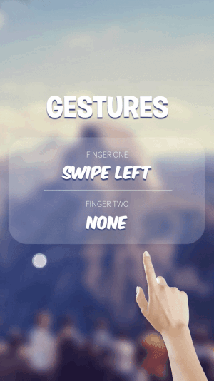

# Multi-Touch Gestures
Multi-Touch Gestures(Java) for detecting custom gestures
 

## Add to your project
Add the jitpack maven repository
```
allprojects {
  repositories {
    ...
    maven { url 'https://jitpack.io' }
  }
}
``` 
Add the dependency
```
dependencies {
  implementation 'com.github.slaviboy:MultiTouchGestures:v0.1.0'
}
```


## Documentation
### Examples
Set up your view(it can be whatever view type you want) using **xml**
```xml
<View
  android:id="@+id/gesture_view"
  android:layout_width="match_parent"
  android:layout_height="match_parent"/>

```

Create your gesture detector object using **java**
```JAVA
// init multi finger gesture detector
GestureDetector detector = new GestureDetector();

// attach gesture detector listener to your view
View view = findViewById(R.id.gesture_view);
view.setOnTouchListener(detector);
```

### Add Listener
```JAVA

detector.setOnGestureListener(new GestureDetector.OnGestureListener() {
  @Override
  public void onStateChange(Finger[] fingers, int fingerIndex) {

  }
});
```

## Supported finger states
At any moment in time, each finger has a current state. Using those states for multiple
fingers, you can form multi-touch gesture.

- NONE
- SWIPE UP 
- SWIPE DOWN  
- SWIPE LEFT  
- SWIPE RIGHT  
- HOLD_DOWN 
- DOWN  
- UP  
- MOVE UP  
- MOVE DOWN  
- MOVE LEFT 
- MOVE RIGHT  
- DOUBLE TAP 

### GestureDetector Object Properties 
* **holdDownDelay** - *(default:100)* delay time(ms) after which if finger is -hold down, state will be changed to HOLD_DOWN
* **upDelay** - *(default:50)* delay time(ms), after which if finger is -swiped, state will be changed to UP
* **consumeTouchEvents** - *(default:true)*  whether to consume touch event after handling
* **numberOfFingers** - *(default:2)* number of allowed fingers, that will be detected

### Finger Object Properties
* **minDistanceSwipe** - *(default:10)* minimum distance finger must travel, before **swipe** can be detected 
* **maxDurationSwipe** - *(default:400)* maximum time after which swipe WILL NOT be detected (ms) 
* **minDistanceMove** - *(default:30)* minimum distance finger must travel, before **move** can be detected 
* **maxDurationDoubleTap** - *(default:250)* maximum delay time between the two -down events for the double tap (ms)
* **maxDownDoubleTap** - *(default:100)* maximum time the finger can be hold down for the two -down events (ms) 
* **slopeIntolerance** - *(default:1)* slope intolerance for swipe and move 
